# OAuth 2.1 Learning Project

A complete implementation of the OAuth 2.1 authorization code flow with PKCE (Proof Key for Code Exchange)
in Go, designed for educational purposes to understand OAuth message exchanges and security mechanisms.

## Table of contents

- [Project overview](#project-overview)
- [Architecture](#architecture)
- [Quick start](#quick-start)
- [Step-by-step OAuth 2.1 flow walkthrough](#step-by-step-oauth-21-flow-walkthrough)
- [Understanding the components](#understanding-the-components)
- [OAuth 2.1 vs OAuth 2.0](#oauth-21-vs-oauth-20)
- [Security features](#security-features)
- [Message logging](#message-logging)
- [Troubleshooting](#troubleshooting)
- [Learning outcomes](#learning-outcomes)
- [API reference](#api-reference)
- [Glossary](#glossary)
- [Real-world OAuth implementation](#real-world-oauth-implementation)
- [Next steps](#next-steps)

## Project overview

This project demonstrates the OAuth 2.1 authorization code flow through three interconnected applications
that communicate using standard OAuth protocols.
It's designed to provide hands-on learning about OAuth security mechanisms, message exchanges,
and implementation patterns.

### Purpose

- **Educational**: Learn OAuth 2.1 concepts through practical implementation
- **Visual**: See all OAuth messages with detailed logging and color coding
- **Complete**: Experience the full flow from authorization to resource access
- **Secure**: Implement modern OAuth 2.1 security features like mandatory PKCE

### Target audience

- Developers learning OAuth 2.1 implementation
- Engineers implementing OAuth in MCP servers or other applications
- Anyone wanting to understand OAuth message flows and security

## Architecture

The system consists of three independent applications:


### Component responsibilities

- **Client Application**: Web interface that initiates OAuth flows and consumes protected resources
- **Authorization Server**: Handles user authentication, authorization, and token issuance
- **Resource Server**: Protects and serves resources to properly authorized clients

## Quick start

### Prerequisites

- Go 1.21+ installed
- Three available ports: 8080, 8081, 8082

### Installation and setup

1. **Clone and prepare:**

   ```bash
   git clone <repository-url>
   cd oauth-go
   go mod tidy
   ```

1. **Start all three servers** (in separate terminals):

   ```bash
   # Terminal 1: Authorization Server
   go run cmd/auth-server/main.go

   # Terminal 2: Resource Server
   go run cmd/resource-server/main.go

   # Terminal 3: Client Application
   go run cmd/client/main.go
   ```

1. **Access the demo:**

   - Open browser to http://localhost:8080
   - Follow the OAuth flow using demo credentials

### Demo accounts

Three pre-configured accounts are available:

- **alice** / password123
- **bob** / secret456
- **carol** / mypass789

## Step-by-step OAuth 2.1 flow walkthrough

Follow this detailed walkthrough to understand each step of the OAuth 2.1 authorization code flow:

### OAuth 2.1 flow sequence diagram


### Step 1: Start the OAuth flow

1. **Visit the client application** at http://localhost:8080
1. **Observe the initial screen** showing:
   - Client details (ID, redirect URI, scope)
   - Generated PKCE challenge details
   - "Start OAuth Flow" button

**What happens behind the scenes:**

```go
// Client generates PKCE challenge
pkce, _ := oauth.GeneratePKCEChallenge()
// Creates:
// - Code Verifier: 43-character random string
// - Code Challenge: SHA256 hash of verifier (Base64url encoded)
```

**Console output:**

```none
[2024-08-15 10:30:15] CLIENT → USER-BROWSER
Authorization URL Generated:
  authorization_url: http://localhost:8081/authorize?...
  pkce_challenge: xyz123...
  pkce_method: S256
```

### Step 2: Authorization request

1. **Click "Start OAuth Flow"**
1. **Browser redirects** to authorization server with parameters:
   - `client_id=demo-client`
   - `redirect_uri=http://localhost:8080/callback`
   - `scope=read`
   - `state=demo-state-123`
   - `code_challenge=<SHA256_hash>`
   - `code_challenge_method=S256`

**Console output (Authorization Server):**

```none
[2024-08-15 10:30:16] CLIENT → AUTH-SERVER
Authorization Request:
  client_id: demo-client
  redirect_uri: http://localhost:8080/callback
  scope: read
  state: demo-state-123
  code_challenge: xyz123...
  code_challenge_method: S256
  response_type: code
```

### Step 3: User authentication

1. **Login form appears** showing:
   - Application request details
   - OAuth parameters
   - Username/password fields
   - Demo account credentials

1. **Enter credentials** (e.g., alice / password123)

1. **Submit the form**

**What happens behind the scenes:**

```go
// Server validates credentials using bcrypt
user, err := userStore.Authenticate(username, password)
// If successful, generates authorization code
code, _ := oauth.GenerateRandomString(32)
```

**Console output (Authorization Server):**

```none
[2024-08-15 10:30:45] USER → AUTH-SERVER
Login Attempt:
  username: alice
  password: [REDACTED]
```

### Step 4: Authorization grant

1. **Successful authentication** triggers redirect back to client
1. **Authorization code** is appended to redirect URI
1. **Browser returns** to http://localhost:8080/callback?code=xyz&state=demo-state-123

**Console output (Authorization Server):**

```none
[2024-08-15 10:30:46] AUTH-SERVER → CLIENT
Authorization Response:
  code: abc123...
  state: demo-state-123
```

**Console output (Client):**

```none
[2024-08-15 10:30:46] AUTH-SERVER → CLIENT
Authorization Callback:
  code: abc123...
  state: demo-state-123
  error:
```

### Step 5: Display authorization code

1. **Client processes callback** and shows:
   - "Authorization Code Received" message
   - The actual authorization code
   - "Exchange Code for Token" button

**What happens behind the scenes:**

```go
// Client stores the authorization code for later use
c.authCode = code
```

### Step 6: Token exchange

1. **Click "Exchange Code for Token"**
1. **Client sends POST request** to token endpoint with:
   - `grant_type=authorization_code`
   - `code=<authorization_code>`
   - `redirect_uri=http://localhost:8080/callback`
   - `client_id=demo-client`
   - `code_verifier=<original_43_char_string>`

**Console output (Client):**

```none
[2024-08-15 10:31:00] CLIENT → AUTH-SERVER
Token Exchange Request:
  grant_type: authorization_code
  redirect_uri: http://localhost:8080/callback
  client_id: demo-client
  code_verifier: cQpV8MttKOP6c0zDhnTN...
```

**What happens behind the scenes (Authorization Server):**

```go
// 1. Retrieve stored authorization code
authCode, err := store.GetAuthorizationCode(code)

// 2. Verify PKCE challenge
if !oauth.VerifyPKCE(codeVerifier, authCode.CodeChallenge, "S256") {
    return "invalid_grant"
}

// 3. Generate access token
accessToken, _ := oauth.GenerateRandomString(32)
```

**Console output (Authorization Server):**

```none
[2024-08-15 10:31:01] AUTH-SERVER → CLIENT
Token Response:
  access_token: def456...
  token_type: Bearer
  expires_in: 3600
  scope: read
```

### Step 7: Access token received

1. **Client displays success** showing:
   - "Access Token Received" message
   - The access token value
   - "Access Protected Resource" button
   - "Get User Info" button

### Step 8: Access protected resource

1. **Click "Access Protected Resource"**
1. **Client sends GET request** to resource server with:
   - `Authorization: Bearer <access_token>` header

**Console output (Client):**

```none
[2024-08-15 10:31:15] CLIENT → RESOURCE-SERVER
Protected Resource Request:
  Headers:
    Authorization: Bearer def456...
```

**What happens behind the scenes (Resource Server):**

```go
// 1. Extract Bearer token from Authorization header
token := strings.TrimPrefix(authHeader, "Bearer ")

// 2. Validate token (in this demo, simplified validation)
accessToken, err := validateToken(token)

// 3. Serve protected resource
content, _ := os.ReadFile("data/protected-resource.txt")
```

**Console output (Resource Server):**

```none
[2024-08-15 10:31:15] CLIENT → RESOURCE-SERVER
Resource Request:
  path: /protected
  method: GET
  Headers:
    Authorization: Bearer def456...

[2024-08-15 10:31:15] RESOURCE-SERVER → RESOURCE-SERVER
Token Validation Success:
  user_id: validated-user
  client_id: demo-client
  scope: read

[2024-08-15 10:31:15] RESOURCE-SERVER → CLIENT
Protected Resource Response:
  resource_size: 1234
  content_type: text/plain
```

### Step 9: Resource delivered

1. **Client displays the protected resource** content
1. **Flow complete!** User has successfully:
   - Authenticated with the authorization server
   - Authorized the client application
   - Received an access token
   - Accessed protected resources

## Understanding the components

### Authorization server (`cmd/auth-server/`)

**Key responsibilities:**

- User authentication and session management
- Authorization code generation and storage
- PKCE challenge verification
- Access token issuance
- Security validation (redirect URIs, client IDs, etc.)

**Key endpoints:**

- `GET /authorize` - OAuth authorization endpoint
- `POST /login` - Processes user credentials
- `POST /token` - Token exchange endpoint

**Security features:**

- Bcrypt password hashing
- Authorization code expiration (10 minutes)
- PKCE mandatory verification
- State parameter validation

### Resource server (`cmd/resource-server/`)

**Key responsibilities:**

- Access token validation
- Protected resource serving
- Authorization enforcement
- User information provision

**Key endpoints:**

- `GET /protected` - Protected file resource
- `GET /userinfo` - User information endpoint
- `GET /health` - Health check

**Security features:**

- Bearer token validation
- Proper HTTP status codes
- WWW-Authenticate headers

### Client application (`cmd/client/`)

**Key responsibilities:**

- OAuth flow initiation
- PKCE generation and verification
- Authorization code handling
- Token management
- Resource consumption

**Key endpoints:**

- `GET /` - Start OAuth flow
- `GET /callback` - OAuth callback handler
- `GET /exchange` - Token exchange trigger
- `GET /resource` - Access protected resource
- `GET /userinfo` - Get user information

**Security features:**

- PKCE implementation
- State parameter verification
- Secure token storage
- Proper error handling

## OAuth 2.1 vs OAuth 2.0

This implementation showcases key OAuth 2.1 improvements:

### Mandatory PKCE

- **OAuth 2.0**: PKCE optional for public clients
- **OAuth 2.1**: PKCE mandatory for all clients
- **Security benefit**: Prevents authorization code interception attacks

### No implicit flow

- **OAuth 2.0**: Supports implicit flow (tokens in URL fragments)
- **OAuth 2.1**: Implicit flow removed
- **Security benefit**: Eliminates token exposure in browser history/logs

### Enhanced security defaults

- **OAuth 2.0**: Various security features optional
- **OAuth 2.1**: Security-first approach with mandatory protections
- **Security benefit**: Reduced attack surface by default

## Security features

### PKCE (Proof Key for Code Exchange)

**Purpose**: Prevents authorization code interception attacks

**Implementation**:

1. **Code Verifier**: 43-character cryptographically random string
1. **Code Challenge**: Base64url-encoded SHA256 hash of verifier
1. **Challenge Method**: S256 (SHA256)

**Flow**:

```none
Client generates: verifier = "dBjftJeZ4CVP-mB92K27uhbUJU1p1r_wW1gFWFOEjXk"
Client sends: challenge = SHA256(verifier) = "E9Melhoa2OwvFrEMTJguCHaoeK1t8URWbuGJSstw-cM"
Client proves: verifier matches challenge during token exchange
```

#### PKCE security flow diagram

```mermaid
sequenceDiagram
    participant Client as Client Application
    participant AuthServer as Authorization Server
    participant Attacker as 🔴 Potential Attacker

    Note over Client,Attacker: PKCE Security Mechanism

    %% PKCE Generation
    Client->>Client: 1. Generate random verifier<br/>"dBjftJeZ4CVP-mB92K27uhbUJU1p1r_wW1gFWFOEjXk"
    Client->>Client: 2. Create challenge<br/>SHA256(verifier) = "E9Melhoa2OwvFrEMTJguCHaoeK1t8URWbuGJSstw-cM"

    %% Authorization Request with Challenge
    Client->>AuthServer: 3. Authorization Request<br/>code_challenge="E9Melhoa2OwvFrEMTJguCHaoeK1t8URWbuGJSstw-cM"<br/>code_challenge_method="S256"
    AuthServer->>AuthServer: Store challenge with authorization code
    AuthServer->>Client: 4. Authorization Code<br/>"abc123xyz" (via redirect)

    %% Potential Interception
    Note over Attacker: ❌ Attacker intercepts authorization code<br/>but cannot use it without verifier

    %% Token Exchange with Verifier
    Client->>AuthServer: 5. Token Request<br/>code="abc123xyz"<br/>code_verifier="dBjftJeZ4CVP-mB92K27uhbUJU1p1r_wW1gFWFOEjXk"
    AuthServer->>AuthServer: 6. Verify PKCE<br/>SHA256(received_verifier) == stored_challenge
    AuthServer->>Client: 7. ✅ Access Token<br/>(only if PKCE verification succeeds)

    %% Attacker Attempt
    Attacker->>AuthServer: 8. ❌ Token Request with stolen code<br/>code="abc123xyz"<br/>(missing code_verifier)
    AuthServer->>Attacker: 9. ❌ Error: invalid_grant<br/>(PKCE verification fails)
```



### State parameter validation

**Purpose**: Prevents CSRF attacks

**Implementation**: Random state value maintained between authorization request and callback

### Authorization code expiration

**Purpose**: Limits window for code interception

**Implementation**: Codes expire after 10 minutes

### Password security

**Purpose**: Protect user credentials

**Implementation**: Bcrypt hashing with default cost (10 rounds)

## Message logging

All OAuth messages are logged with detailed, color-coded output:

### Log format

```none
[timestamp] SOURCE DIRECTION DESTINATION
Message Type:
  parameter: value
  parameter: value
  Headers:
    header: value
--------------------------------------------------
```

### Color coding

- **Blue**: Client messages
- **Green**: Authorization server messages
- **Yellow**: Resource server messages
- **Red**: Error messages
- **Cyan**: Info messages

### Example log sequence

```none
[2024-08-15 10:30:15] CLIENT → AUTH-SERVER
Authorization Request:
  client_id: demo-client
  scope: read
  code_challenge: xyz123...

[2024-08-15 10:30:46] AUTH-SERVER → CLIENT
Authorization Response:
  code: abc123...
  state: demo-state-123

[2024-08-15 10:31:01] CLIENT → AUTH-SERVER
Token Exchange Request:
  grant_type: authorization_code
  code_verifier: cQpV8MttKOP6c0zDhnTN...

[2024-08-15 10:31:01] AUTH-SERVER → CLIENT
Token Response:
  access_token: def456...
  token_type: Bearer
  expires_in: 3600
```

## Troubleshooting

### Common issues

#### "invalid credentials" for all users

- **Cause**: Incorrect bcrypt hashes
- **Solution**: Use `go run cmd/hash-passwords/main.go` to generate new hashes

#### "authorization code not found"

- **Cause**: Code not properly stored or expired
- **Solution**: Complete flow within 10 minutes, check client code storage

#### "PKCE verification failed"*

- **Cause**: Code verifier doesn't match challenge
- **Solution**: Ensure PKCE challenge is properly stored between requests

#### Port already in use

- **Cause**: Another process using the port
- **Solution**: Find with `lsof -i :8080` and kill, or change port in code

#### Template not found

- **Cause**: Running from wrong directory
- **Solution**: Run from project root where `web/templates/` exists

### Debug tips

1. **Check all three servers are running** on correct ports
1. **Watch console logs** for detailed OAuth message flows
1. **Verify demo accounts** with password hashing utility
1. **Clear browser cache** if experiencing unexpected redirects
1. **Use browser developer tools** to inspect network requests

### Log analysis

**Successful flow pattern:**

```none
Authorization Request → Authorization Response → Token Request → Token Response → Resource Request → Resource Response
```

**Failed authentication:**

```none
Authorization Request → Login Attempt → ERROR: Invalid credentials
```

**PKCE failure:**

```none
Authorization Request → Authorization Response → Token Request → ERROR: PKCE verification failed
```

## Dynamic Client Registration (RFC 7591)

This implementation now includes **Dynamic Client Registration**, a key feature required for modern OAuth clients like Claude Code.

### What is Dynamic Client Registration?

Dynamic Client Registration allows OAuth clients to register themselves programmatically at runtime, without requiring manual pre-configuration by the authorization server administrator.

### Why is it important?

- **Claude Code compatibility**: Required for Claude Code and similar tools
- **Scalability**: No manual client configuration needed
- **Flexibility**: Clients can register with custom redirect URIs
- **Standards compliance**: Follows RFC 7591 specification

### Using Dynamic Client Registration

**Registration endpoint:**
```http
POST /register
Content-Type: application/json

{
  "redirect_uris": ["https://client.example.com/callback"],
  "client_name": "My OAuth Client",
  "application_type": "web"
}
```

**Response:**
```json
{
  "client_id": "abc123...",
  "client_secret": "def456...",
  "redirect_uris": ["https://client.example.com/callback"],
  "response_types": ["code"],
  "grant_types": ["authorization_code"],
  "application_type": "web",
  "client_name": "My OAuth Client",
  "token_endpoint_auth_method": "client_secret_post"
}
```

### Testing Dynamic Client Registration

**1. Register a new client:**
```bash
curl -X POST http://localhost:8081/register \
  -H "Content-Type: application/json" \
  -d '{
    "redirect_uris": ["http://localhost:3000/callback"],
    "client_name": "Test Client",
    "application_type": "web"
  }'
```

**2. Use the returned client_id in authorization flows:**
The dynamically registered client can now be used exactly like the demo client for the full OAuth flow.

### OAuth Discovery Enhanced

The discovery endpoint now includes the registration endpoint:

```bash
curl http://localhost:8081/.well-known/oauth-authorization-server
```

Returns:
```json
{
  "issuer": "http://localhost:8081",
  "authorization_endpoint": "http://localhost:8081/authorize",
  "token_endpoint": "http://localhost:8081/token",
  "registration_endpoint": "http://localhost:8081/register",
  "response_types_supported": ["code"],
  "grant_types_supported": ["authorization_code"],
  "code_challenge_methods_supported": ["S256"],
  "scopes_supported": ["read"],
  "token_endpoint_auth_methods_supported": ["none", "client_secret_post"]
}
```

## Learning outcomes

After completing this walkthrough, you will understand:

### OAuth 2.1 concepts

- Authorization code flow with PKCE
- Client types and security considerations
- Token-based authorization
- Scope and permissions

### Security mechanisms

- PKCE prevents code interception
- State parameter prevents CSRF
- Proper token validation
- Secure credential handling

### Implementation patterns

- Multi-component OAuth architecture
- HTTP redirects and callbacks
- Token exchange protocols
- Error handling strategies

### Real-world considerations

- Token expiration and refresh
- Scope validation
- Client authentication
- Production security requirements
- Dynamic Client Registration
- OAuth discovery endpoints
- Enhanced error handling
- Client validation and redirect URI security

## API reference

### Authorization server endpoints

#### GET /authorize

**Purpose**: OAuth 2.1 authorization endpoint

**Parameters**:

- `client_id` (required): Client identifier
- `redirect_uri` (required): Callback URL
- `scope` (required): Requested permissions
- `state` (required): CSRF protection
- `code_challenge` (required): PKCE challenge
- `code_challenge_method` (required): Must be "S256"
- `response_type` (required): Must be "code"

**Response**: HTML login form or redirect to callback

#### POST /login

**Purpose**: Process user authentication

**Parameters** (form data):

- `username` (required): User identifier
- `password` (required): User password
- OAuth parameters from authorization request

**Response**: Redirect to client callback with authorization code

#### POST /token

**Purpose**: Exchange authorization code for access token

**Parameters** (form data):

- `grant_type` (required): Must be "authorization_code"
- `code` (required): Authorization code from callback
- `redirect_uri` (required): Must match authorization request
- `client_id` (required): Client identifier
- `code_verifier` (required): PKCE verifier

**Response**: JSON with access token

### Resource server endpoints

#### GET /protected

**Purpose**: Serve protected resource

**Headers**:

- `Authorization: Bearer <access_token>` (required)

**Response**: Protected file content

#### GET /userinfo

**Purpose**: Provide user information

**Headers**:

- `Authorization: Bearer <access_token>` (required)

**Response**: JSON with user details

#### GET /health

**Purpose**: Health check endpoint

**Response**: JSON with server status

### Client endpoints

#### GET /

**Purpose**: Start OAuth flow

**Response**: HTML with authorization URL and PKCE details

#### GET /callback

**Purpose**: Handle OAuth callback

**Parameters**:

- `code`: Authorization code (success case)
- `error`: Error code (error case)
- `state`: CSRF protection value

**Response**: HTML showing code or error

#### GET /exchange

**Purpose**: Trigger token exchange

**Response**: HTML showing access token or error

#### GET /resource

**Purpose**: Access protected resource

**Response**: HTML showing resource content

#### GET /userinfo

**Purpose**: Get user information

**Response**: HTML showing user details

## Glossary

### OAuth terminology

**Access Token**: A credential used by clients to access protected resources.
Contains authorization information and has a limited lifetime.

**Authorization Code**: A temporary credential representing the authorization granted by the resource owner.
Exchanged for an access token.

**Authorization Server**: The server that authenticates the resource owner and issues access tokens
after successful authorization.

**Client**: An application making protected resource requests on behalf of the resource owner with its authorization.

**Client ID**: A public identifier for the client application, issued by the authorization server.

**Grant Type**: The method used by the client to obtain an access token (e.g., `authorization_code`).

**PKCE (Proof Key for Code Exchange)**: A security extension that prevents authorization code
interception attacks by requiring clients to prove possession of a cryptographic secret.

**Redirect URI**: The URI the authorization server redirects the user-agent to after authorization completion.

**Resource Owner**: The entity (typically a user) capable of granting access to a protected resource.

**Resource Server**: The server hosting the protected resources, capable of accepting and responding
to protected resource requests using access tokens.

**Scope**: A parameter defining the access privileges requested by the client or granted by the authorization server.

**State Parameter**: A value used by the client to maintain state between the authorization request
and callback, also serves as CSRF protection.

### PKCE terminology

**Code Challenge**: A derived value from the code verifier, sent during the authorization request (SHA256 hash).

**Code Challenge Method**: The method used to derive the code challenge from the verifier
(always "S256" in OAuth 2.1).

**Code Verifier**: A cryptographically random string generated by the client, kept secret and used
to prove ownership during token exchange.

### HTTP status codes

**200 OK**: Successful request with response body.

**302 Found**: Redirect response used in OAuth flows.

**400 Bad Request**: Invalid request parameters or malformed request.

**401 Unauthorized**: Missing or invalid access token.

**404 Not Found**: Requested resource does not exist.

### Security terms

**CSRF (Cross-Site Request Forgery)**: An attack that forces authenticated users to submit unauthorized requests.

**Bearer Token**: A type of access token where possession of the token is sufficient
for access (no additional proof required).

**Bcrypt**: A password hashing function designed to be computationally expensive to resist brute-force attacks.

**Base64url Encoding**: A variant of Base64 encoding that is URL-safe
(uses different characters for padding and special symbols).

## Real-world OAuth implementation

After seeing the step-by-step educational flow, you might wonder how OAuth works in production applications.
In reality, most technical steps happen automatically behind the scenes, creating a seamless user experience.

### User experience in production

In real-world applications, users typically see:

1. **User visits your app** (e.g., a photo-sharing service)
1. **Clicks "Login with Google"** (or GitHub, Facebook, etc.)
1. **Gets redirected to Google's login page** (if not already logged in)
1. **Sees authorization prompt**: "PhotoApp wants to access your profile and email"
1. **Clicks "Allow"**
1. **Immediately returns to PhotoApp, now logged in**

That's it! Just 3-4 clicks from the user's perspective.

### What happens automatically behind the scenes


### Key differences from our educational demo

**In our learning project:**
- Manual steps: User clicks "Exchange Code for Token"
- Visible tokens: Access tokens displayed on screen
- Separate steps: Each OAuth phase is a separate page/action
- Detailed logging: All messages shown for educational purposes

**In production applications:**
- Automatic token exchange: Happens via JavaScript or backend code
- Hidden tokens: Stored securely, never shown to users
- Seamless flow: User goes from "not logged in" to "logged in" in one flow
- Background API calls: User profile fetching happens automatically

### Browser-based applications (Web Apps)

**Frontend JavaScript example:**
```javascript
// User clicks "Login with Google"
function loginWithGoogle() {
    // Generate PKCE challenge (automatic)
    const codeVerifier = generateRandomString();
    const codeChallenge = sha256(codeVerifier);

    // Store verifier securely
    sessionStorage.setItem('pkce_verifier', codeVerifier);

    // Redirect to OAuth provider
    window.location.href = `https://accounts.google.com/oauth/authorize?
        client_id=your-client-id&
        redirect_uri=https://yourapp.com/callback&
        scope=openid email profile&
        code_challenge=${codeChallenge}&
        code_challenge_method=S256`;
}

// Automatic callback handler
function handleCallback() {
    const code = new URLSearchParams(window.location.search).get('code');
    const verifier = sessionStorage.getItem('pkce_verifier');

    // Exchange code for token (AJAX, automatic)
    fetch('/api/token-exchange', {
        method: 'POST',
        body: JSON.stringify({ code, code_verifier: verifier })
    })
    .then(response => response.json())
    .then(data => {
        // Store tokens securely
        localStorage.setItem('access_token', data.access_token);
        // Fetch user profile and show dashboard
        showLoggedInDashboard(data.user);
    });
}
```

### Terminal/CLI applications (like Claude Code)

Terminal applications can't redirect users to web browsers in the same way, so they use different OAuth flows:

#### Device Authorization Grant (RFC 8628)

This is perfect for CLI tools like Claude Code accessing your MCP server:


#### Claude Code + MCP Server scenario

Here's exactly how this would work for Claude Code accessing your MCP server:

**1. Initial setup (one-time):**
```bash
$ claude-code configure mcp-server https://your-mcp-server.com
Starting OAuth setup for MCP server...

Visit: https://your-mcp-server.com/device
Enter code: WXYZ-5678

Waiting for authorization...
```

**2. User authorizes in browser:**
- User opens https://your-mcp-server.com/device
- Enters code WXYZ-5678
- Logs in with their credentials
- Grants permission to Claude Code

**3. CLI receives authorization:**
```bash
✅ Authorization successful!
Access token stored securely.
Claude Code can now access your MCP server.
```

**4. Subsequent usage (automatic):**
```bash
$ claude-code chat
# Claude Code automatically uses stored token to access MCP server
# No user interaction needed for subsequent requests
```

#### Local web server approach (alternative)

Some CLI tools use a temporary local web server:

```bash
$ claude-code auth
Starting local callback server on http://localhost:8080
Opening browser to: https://your-mcp-server.com/oauth/authorize?...

# Browser automatically opens
# User authorizes in browser
# Browser redirects to localhost:8080
# CLI receives callback and stores token
# Local server shuts down

✅ Authentication complete!
```

### Production implementation patterns

**Real-world examples:**

1. **GitHub CLI (`gh auth login`)**:
   - Uses device flow
   - Shows verification URL and code
   - Polls GitHub until authorized

1. **Google Cloud CLI (`gcloud auth login`)**:
   - Opens browser automatically
   - Uses local callback server
   - Stores tokens in user's config directory

1. **AWS CLI (`aws configure sso`)**:
   - Device flow for headless environments
   - Browser flow for desktop use

1. **Docker CLI (`docker login`)**:
   - Simple username/password for Docker Hub
   - OAuth for registry integrations

### Security considerations for CLI applications

**Token storage:**
- Store in OS-specific secure locations
- Encrypt tokens at rest
- Use short-lived tokens with refresh capability

**PKCE in CLI apps:**
- Still required for security
- Generated and managed automatically
- User never sees technical details

**Error handling:**
- Graceful timeout if user doesn't authorize
- Clear instructions for manual token entry
- Fallback authentication methods

### MCP server OAuth implementation

For your MCP server, you'd implement:

**1. Device authorization endpoint:**
```go
// POST /oauth/device
func (s *Server) deviceAuthorization(w http.ResponseWriter, r *http.Request) {
    deviceCode := generateRandomString(32)
    userCode := generateUserFriendlyCode() // "ABCD-1234"

    // Store device code with expiration
    s.deviceCodes[deviceCode] = &DeviceCode{
        UserCode:  userCode,
        ExpiresAt: time.Now().Add(10 * time.Minute),
        Status:    "pending",
    }

    json.NewEncoder(w).Encode(map[string]interface{}{
        "device_code":      deviceCode,
        "user_code":        userCode,
        "verification_uri": "https://your-mcp-server.com/device",
        "interval":         5, // polling interval in seconds
        "expires_in":       600,
    })
}
```

**2. User verification page:**
```go
// GET /device - show code entry form
// POST /device - verify code and create user session
func (s *Server) deviceVerification(w http.ResponseWriter, r *http.Request) {
    if r.Method == "POST" {
        userCode := r.FormValue("user_code")
        // Validate user login + associate device with user
        // Update device code status to "authorized"
    }
    // Show HTML form for code entry
}
```

**3. Token endpoint for CLI polling:**
```go
// POST /oauth/token (device flow)
func (s *Server) deviceToken(w http.ResponseWriter, r *http.Request) {
    deviceCode := r.FormValue("device_code")

    device := s.deviceCodes[deviceCode]
    if device.Status == "pending" {
        // Return "authorization_pending"
        http.Error(w, "authorization_pending", 400)
        return
    }

    if device.Status == "authorized" {
        // Generate access token
        accessToken := generateAccessToken(device.UserID)
        json.NewEncoder(w).Encode(map[string]interface{}{
            "access_token": accessToken,
            "token_type":   "Bearer",
            "expires_in":   3600,
        })
    }
}
```

This approach gives you the security of OAuth 2.1 while providing a smooth experience for both web and CLI applications!

### OAuth discovery endpoints (.well-known)

In our educational demo, we hardcoded all the OAuth endpoints (authorize, token, etc.).
In production systems, you'll often see **discovery endpoints** that automatically provide this configuration:

#### What are .well-known endpoints?

These are standardized URLs that return JSON metadata about the OAuth/OpenID Connect server:

- **`/.well-known/oauth-authorization-server`** (RFC 8414) - OAuth 2.0 metadata
- **`/.well-known/openid-configuration`** (OpenID Connect) - Includes OAuth + identity features

#### Why use discovery endpoints?

**Manual configuration (our demo):**
```javascript
const authServer = {
    authorizeEndpoint: "http://localhost:8081/authorize",
    tokenEndpoint: "http://localhost:8081/token",
    // Client has to know all endpoints
};
```

**Discovery-based configuration:**
```javascript
// Client only needs the base URL
const config = await fetch("https://auth.example.com/.well-known/oauth-authorization-server");
const metadata = await config.json();

// Automatically discovers all endpoints
console.log(metadata.authorization_endpoint); // "https://auth.example.com/oauth/authorize"
console.log(metadata.token_endpoint);         // "https://auth.example.com/oauth/token"
```

#### Real-world examples

**Keycloak discovery:**
```bash
curl https://your-keycloak.com/auth/realms/myrealm/.well-known/openid-configuration
```

**Google discovery:**
```bash
curl https://accounts.google.com/.well-known/openid-configuration
```

**GitHub (OAuth 2.0 only):**
```bash
curl https://github.com/.well-known/oauth-authorization-server
```

#### Sample discovery response

```json
{
  "issuer": "https://auth.example.com",
  "authorization_endpoint": "https://auth.example.com/oauth/authorize",
  "token_endpoint": "https://auth.example.com/oauth/token",
  "userinfo_endpoint": "https://auth.example.com/oauth/userinfo",
  "device_authorization_endpoint": "https://auth.example.com/oauth/device",
  "revocation_endpoint": "https://auth.example.com/oauth/revoke",
  "jwks_uri": "https://auth.example.com/.well-known/jwks.json",
  "scopes_supported": ["openid", "profile", "email"],
  "response_types_supported": ["code"],
  "grant_types_supported": ["authorization_code", "refresh_token", "urn:ietf:params:oauth:grant-type:device_code"],
  "code_challenge_methods_supported": ["S256"],
  "token_endpoint_auth_methods_supported": ["client_secret_basic", "client_secret_post"]
}
```

#### Benefits for client applications

1. **Dynamic configuration**: No hardcoded URLs
1. **Environment flexibility**: Same client code works with dev/staging/prod
1. **Feature detection**: Client knows what the server supports
1. **Future-proofing**: New endpoints automatically discovered

#### Implementation in our demo

We didn't include discovery in our educational demo because:
- **Learning focus**: We wanted to show the explicit OAuth endpoints
- **Simplicity**: Direct endpoints are easier to understand initially
- **Manual demonstration**: Each step is visible and traceable

However, let's add a discovery endpoint to show how it works:

```go
// GET /.well-known/oauth-authorization-server
func (as *AuthServer) discovery(w http.ResponseWriter, r *http.Request) {
    metadata := map[string]interface{}{
        "issuer":                     "http://localhost:8081",
        "authorization_endpoint":     "http://localhost:8081/authorize",
        "token_endpoint":            "http://localhost:8081/token",
        "scopes_supported":          []string{"read"},
        "response_types_supported":   []string{"code"},
        "grant_types_supported":     []string{"authorization_code"},
        "code_challenge_methods_supported": []string{"S256"},
        "token_endpoint_auth_methods_supported": []string{"none"}, // public client
    }

    w.Header().Set("Content-Type", "application/json")
    json.NewEncoder(w).Encode(metadata)
}
```

This makes client integration much more robust and follows OAuth 2.0 best practices!

## Next steps

### Extend the implementation

1. **Add refresh tokens** with rotation:

   ```go
   type TokenResponse struct {
       AccessToken  string `json:"access_token"`
       RefreshToken string `json:"refresh_token"`
       ExpiresIn    int64  `json:"expires_in"`
   }
   ```

1. **Implement token introspection** (RFC 7662):

   ```go
   // POST /introspect
   func (as *AuthServer) introspect(w http.ResponseWriter, r *http.Request) {
       token := r.FormValue("token")
       // Validate and return token metadata
   }
   ```

1. **Add scopes and permissions**:

   ```go
   type Scope struct {
       Name        string
       Description string
       Resources   []string
   }
   ```

1. **Implement client authentication**:

   ```go
   type Client struct {
       ID           string
       Secret       string
       RedirectURIs []string
       Type         string // "public" or "confidential"
   }
   ```

### Production considerations

1. **Persistent storage**: Replace in-memory stores with databases
1. **Rate limiting**: Implement brute force protection
1. **Audit logging**: Track all security events
1. **HTTPS enforcement**: Never run OAuth over HTTP in production
1. **CORS handling**: Properly configure cross-origin policies
1. **Token introspection**: Enable distributed token validation
1. **Client registration**: Dynamic client registration (RFC 7591)
1. **Device flow**: Support for devices without browsers (RFC 8628)

### Integration patterns

1. **API Gateway integration**: Token validation at gateway level
1. **Microservices**: Distributed token validation
1. **Single Sign-On**: Multiple client applications
1. **Mobile applications**: Native app integration patterns
1. **Third-party providers**: Integration with external OAuth providers

This project provides a solid foundation for understanding OAuth 2.1 and implementing
secure authorization systems in production environments.
